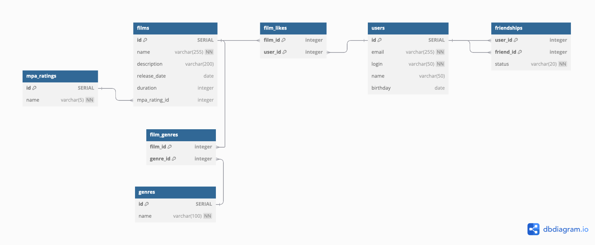

# **java-filmorate**

### Database schema

```dbml
// Docs: https://dbml.dbdiagram.io/docs

Table films {
  id SERIAL [primary key]
  name varchar(255) [not null]
  description varchar(200) 
  release_date date
  duration integer
  mpa_rating_id integer [ref: > mpa_ratings.id]
}

Table users {
  id SERIAL [primary key]
  email varchar(255) [unique, not null]
  login varchar(50) [unique, not null]
  name varchar(50)
  birthday date
}

Table mpa_ratings {
  id SERIAL [primary key]
  rating varchar(5) [unique, not null]
}

Table genres {
  id SERIAL [primary key]
  name varchar(100) [unique, not null]
}

Table film_genres {
  film_id integer
  genre_id integer
  indexes {
    (film_id, genre_id) [pk]
  }
}

Table likes {
  film_id integer
  user_id integer
  indexes {
    (film_id, user_id) [pk]
  }
}

Table friendships {
  user_id integer
  friend_id integer
  status varchar(20) [not null]
  indexes {
    (user_id, friend_id) [pk]
  }
}

Ref: film_genres.film_id > films.id [on delete cascade]
Ref: film_genres.genre_id > genres.id [on delete cascade]
Ref: likes.film_id > films.id [on delete cascade]
Ref: likes.user_id > users.id [on delete cascade]
Ref: friendships.user_id > users.id [on delete cascade]
Ref: friendships.friend_id > users.id [on delete cascade]
```
## Основные операции с базой данных
### 1. Операции с фильмами (Films)
#### a. Создание нового фильма
```sql
INSERT INTO films (name, description, release_date, duration, mpa_rating_id)
VALUES ('Inception', 'A mind-bending thriller', '2010-07-16', 148, 1);
```
#### b. Получение списка всех фильмов
```sql
SELECT * FROM films;
```
#### c. Получение информации о фильме по ID
```sql
SELECT * FROM films WHERE id = 1;
```
#### d. Обновление информации о фильме
```sql
UPDATE films
SET description = 'A mind-bending thriller with new plot twists'
WHERE id = 1;
```
#### e. Удаление фильма
```sql
DELETE FROM films WHERE id = 1;
```
### 2. Операции с пользователями (Users)
#### a. Создание нового пользователя
```sql
INSERT INTO users (email, login, name, birthday)
VALUES ('johndoe@example.com', 'johndoe', 'John Doe', '1990-05-15');
```
#### b. Получение списка всех пользователей
```sql
SELECT * FROM users;
```
#### c. Получение информации о пользователе по ID
```sql
SELECT * FROM users WHERE id = 1;
```
#### d. Обновление информации о пользователе
```sql
UPDATE users
SET name = 'Johnathan Doe', birthday = '1991-01-01'
WHERE id = 1;
```
#### e. Удаление пользователя
```sql
DELETE FROM users WHERE id = 1;
```
### 3. Операции с жанрами (Genres)
#### a. Добавление нового жанра
```sql
INSERT INTO genres (name)
VALUES ('Comedy');
```
#### b. Получение списка всех жанров
```sql
SELECT * FROM genres;
```
#### c. Удаление жанра по ID
```sql
SELECT * FROM genres WHERE id = 1;
```
### 4. Операции с фильмами и жанрами (Film Genres)
#### a. Добавление жанра для фильма
```sql
INSERT INTO film_genres (film_id, genre_id)
VALUES (1, 2);  -- где 1 — это id фильма, а 2 — id жанра
```
#### b. Получение жанров для фильма
```sql
SELECT g.name
FROM genres g
         JOIN film_genres fg ON g.id = fg.genre_id
WHERE fg.film_id = 1;
```
### 5. Операции с лайками (Likes)
#### a. Добавление лайка
```sql
INSERT INTO likes (film_id, user_id)
VALUES (1, 1);  -- где 1 — это id фильма и id пользователя
```
#### b. Удаление лайка
```sql
DELETE FROM likes WHERE film_id = 1 AND user_id = 1;
```
#### c. Получение лайков для фильма
```sql
SELECT u.name
FROM users u
         JOIN likes l ON u.id = l.user_id
WHERE l.film_id = 1;
```
#### d. Получение N самых популярных фильмов
```sql
SELECT f.id, f.name, COUNT(l.user_id) AS like_count
FROM films f
         LEFT JOIN likes l ON f.id = l.film_id
GROUP BY f.id
ORDER BY like_count DESC
    LIMIT N;
```
### 6. Операции с друзьями (Friendships)
#### a. Отправить запрос на добавление в друзья
```sql
INSERT INTO friendships (user_id, friend_id, status)
VALUES (1, 2, 'pending');  -- где 1 — это id пользователя, 2 — id друга
```
#### b. Подтвердить запрос в друзья
```sql
UPDATE friendships
SET status = 'confirmed'
WHERE user_id = 1 AND friend_id = 2;
```
#### c. Удаление из друзей
```sql
DELETE FROM friendships
WHERE user_id = 1 AND friend_id = 2;
```
#### d. Получить список друзей пользователя
```sql
SELECT u.name
FROM users u
         JOIN friendships f ON u.id = f.friend_id
WHERE f.user_id = 1 AND f.status = 'confirmed';
```
